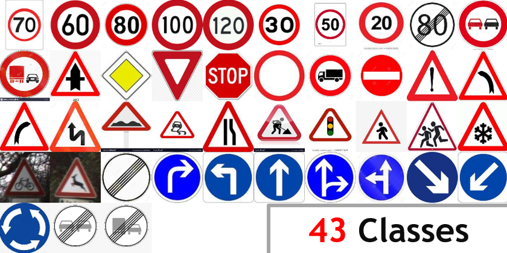
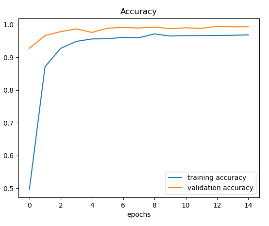
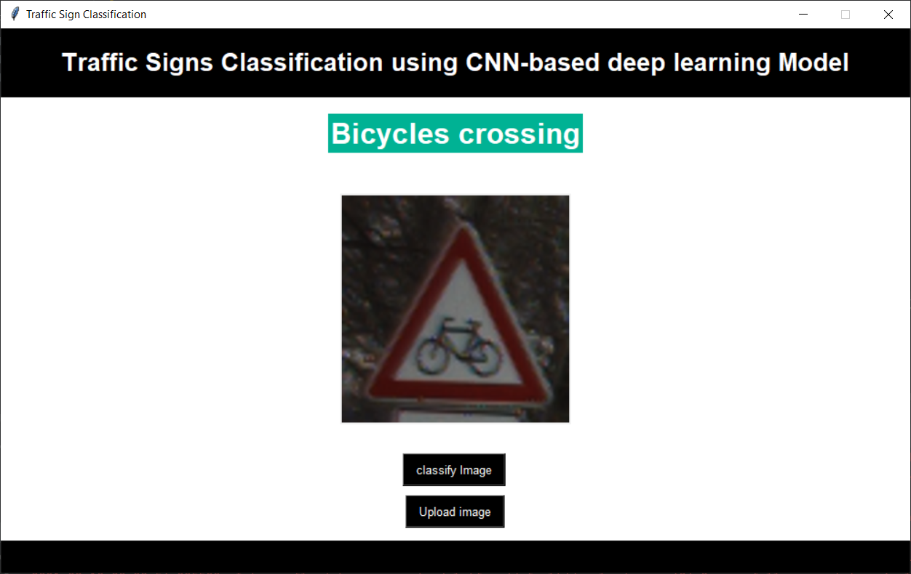
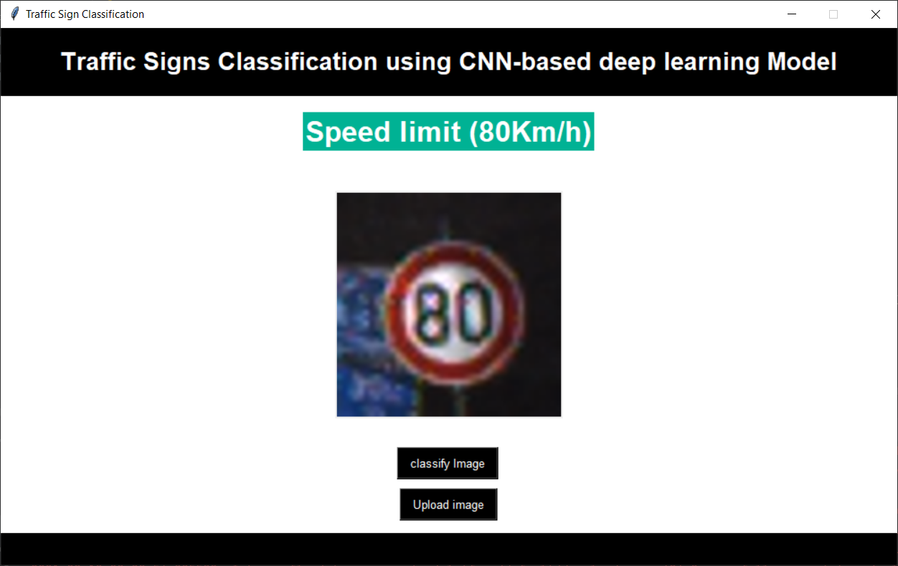
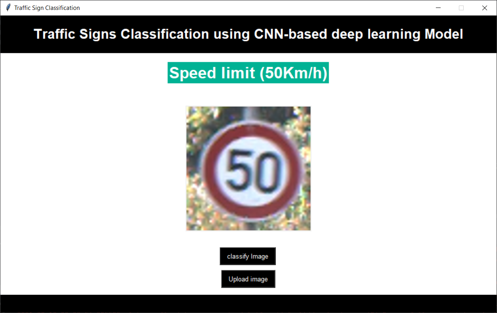

# Traffic Signs Recognition
You must have heard about the **self-driving** cars in which the passenger can fully depend on the car for traveling. But to achieve **level 5 autonomous**, it is necessary for vehicles to understand and follow all traffic rules.

In the world of Artificial Intelligence and advancement in technologies, many researchers and big companies like Tesla, Uber, Google, Mercedes-Benz, Toyota, Ford, Audi, etc are working on autonomous vehicles and self-driving cars. So, for achieving accuracy in this technology, the vehicles should be able to interpret traffic signs and make decisions accordingly.

## What is Traffic Signs Recognition?
There are several different types of traffic signs like speed limits, no entry, traffic signals, turn left or right, children crossing, no passing of heavy vehicles, etc. Traffic signs classification is the process of identifying which class a traffic sign belongs to.

In this Python project, we will build a deep neural network model that can classify traffic signs present in an image into 43 categories:

With this model, we are able to read and understand traffic signs which are a very important task for all autonomous vehicles

### **GTSRB (German Traffic Sign Recognition Benchmark)** was used to train and validate our Model:

### Finally, we developed a Graphical User Interface that allows you to upload traffic sings images and classify them to their corresponding classes:

